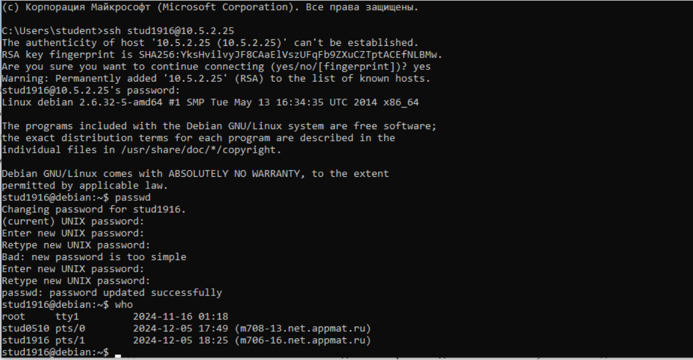
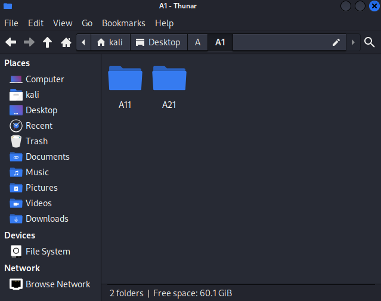
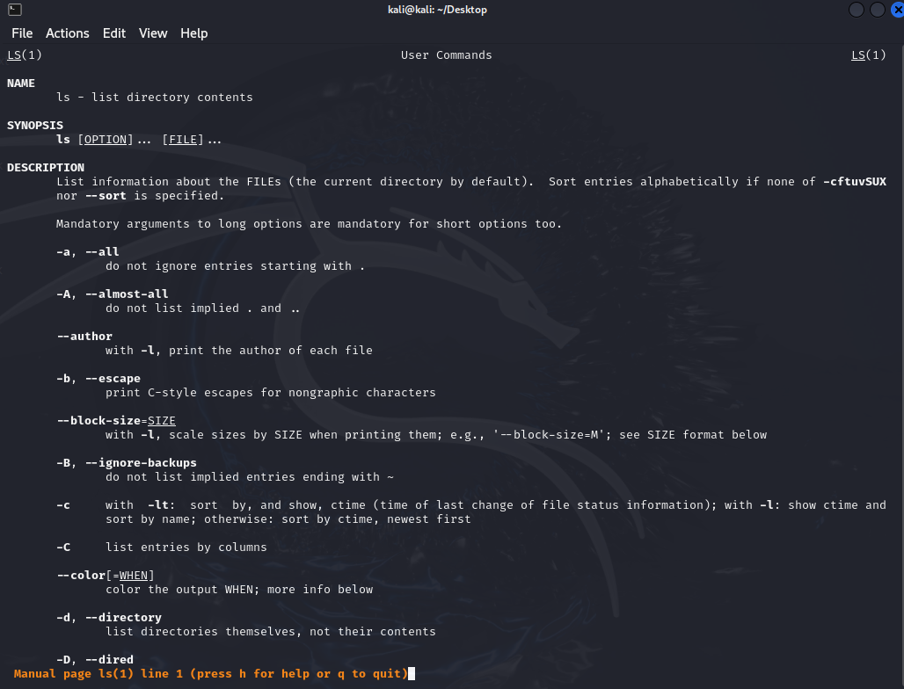
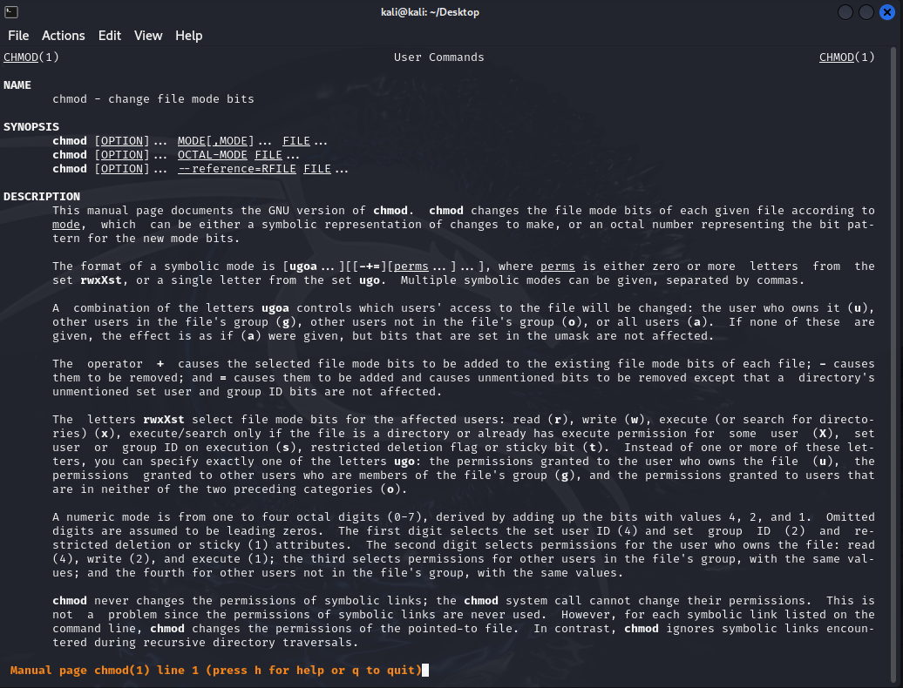
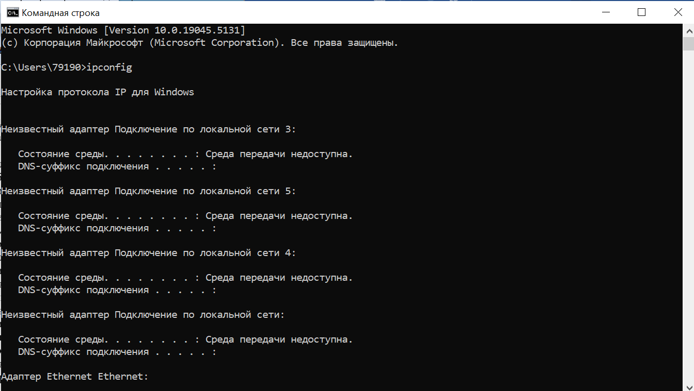
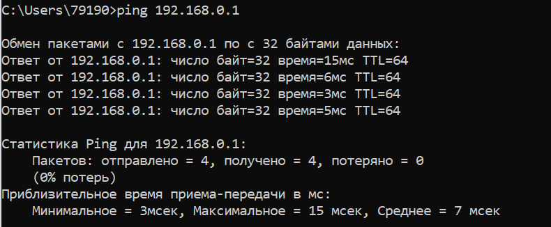
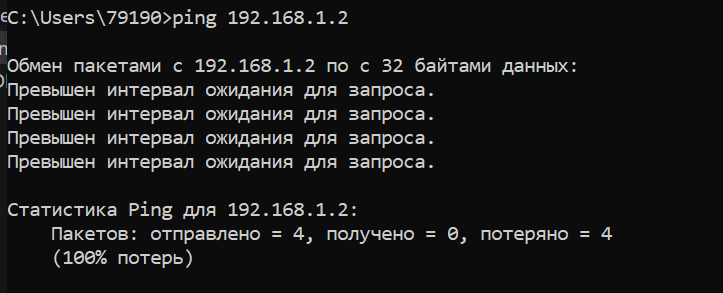
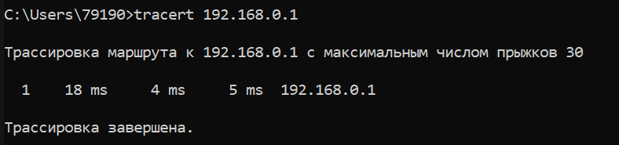

# ЛР №5
#### Сбудышева Людмила А-18-22
<br><br>

<p style="color: pink; font-weight: bold; font-size: 20px;">Операционная система UNIX. Часть 1</p>

---

#### 1. Войти в систему (логин и пароль, а также IP-адрес сервера следует  узнать у преподавателя). 



#### 2. Изменить пароль (раsswd). Выполнить просмотр информации о работающих пользователях (who). 

```                                                                                                            
┌──(kali㉿kali)-[~]
└─$ passwd
Changing password for kali.
Current password: 
New password: 
Retype new password: 
The password has not been changed.
New password: 
Retype new password: 
You must choose a longer password.
New password: 
Retype new password: 
passwd: password updated successfully
```

```
┌──(kali㉿kali)-[~]
└─$ who
kali     tty7         2024-12-03 11:52 (:0)
```

---

#### 3. Познакомиться со справочным руководством (man). 

```
┌──(kali㉿kali)-[~]
└─$ man man
MAN(1)                                            Manual pager utils                                           MAN(1)

NAME
       man - an interface to the system reference manuals

SYNOPSIS
       man [man options] [[section] page ...] ...
       man -k [apropos options] regexp ...
       man -K [man options] [section] term ...
       man -f [whatis options] page ...
       man -l [man options] file ...
       man -w|-W [man options] page ...

DESCRIPTION
       man  is the system's manual pager.  Each page argument given to man is normally the name of a program, utility
       or function.  The manual page associated with each of these arguments is then found and displayed.  A section,
       if provided, will direct man to look only in that section of the manual.  The default action is to  search  in
       all  of  the  available sections following a pre-defined order (see DEFAULTS), and to show only the first page
       found, even if page exists in several sections.
```

> Описание команды очень большое, чтобы полностью его вставить в отчет, поэтому вот маленький кусочек.

---

#### 4. В своем домашнем каталоге создать иерархическую 3-х уровневую структуру из 6-ти каталогов (например, каталог А с подкаталогами А1 и А2; в подкаталоге А1 создать подкаталоги А11 и А21; в подкаталоге А11 создать текстовые файлы file1.tхt и fіlе2.tхt и т.п.). 

```
┌──(kali㉿kali)-[~]
└─$ cd Desktop 
                                                                                                                      
┌──(kali㉿kali)-[~/Desktop]
└─$ mkdir -p A/A1/A11 A/A1/A21 A/A2                                                                                                                    
                                                                                                                      
┌──(kali㉿kali)-[~/Desktop]
└─$ echo "Hello World"             
Hello World
                                                                                                                      
┌──(kali㉿kali)-[~/Desktop]
└─$ echo "Hello World1" > A/A1/A11/file1.txt 
                                                                                                                      
┌──(kali㉿kali)-[~/Desktop]
└─$ echo "Hello World2" > A/A1/A11/file2.txt 
```

---

#### 5. Осуществить просмотр содержимого созданных файлов (саt, more). 

```
┌──(kali㉿kali)-[~/Desktop]
└─$ cat A/A1/A11/file1.txt 
Hello World1
```

> для того, чтобы увидеть различия в работе cat more, добавим в file2.txt побольше строчек Hello World2

```
┌──(kali㉿kali)-[~/Desktop]
└─$ echo "Hello World2" >> A/A1/A11/file2.txt 
```

```
┌──(kali㉿kali)-[~/Desktop]
└─$ cat A/A1/A11/file2.txt 
Hello World2
Hello World2
Hello World2
Hello World2
Hello World2
Hello World2
Hello World2
Hello World2
```

```
┌──(kali㉿kali)-[~/Desktop]
└─$ more A/A1/A11/file2.txt 
Hello World2
Hello World2
Hello World2
Hello World2
Hello World2
Hello World2
Hello World2
Hello World2
--More--(89%)
```

> cat выводит весь файл сразу, а more позволяет постранично просматривать большие файлы

---

#### 6. Создать файлы различных типов (саt, mкdіr, mknоd, ln). 

```
┌──(kali㉿kali)-[~/Desktop]
└─$ cat > A/A1/A21/file_cat.txt                                
cat cat cat cat cat cat cat cat
cat cat cat cat cat
```
> Команда cat может быть использована для создания новых файлов.
```
┌──(kali㉿kali)-[~/Desktop]
└─$ mkdir new_A 
```
> Команда mkdir (от "make directory") используется для создания новых каталогов.
```
┌──(kali㉿kali)-[~/Desktop]
└─$ sudo mknod block b 1 2
[sudo] password for kali: 
Sorry, try again.
[sudo] password for kali: 

┌──(kali㉿kali)-[~/Desktop]
└─$ sudo mknod char c 1 3  
```
> Команда mknod используется для создания специальных файлов, таких как блочные устройства (b) и символьные устройства (c).

>  sudo mknod [имя файла] [b/c — тип файла] [основной номер устройства] [дополнительный номер устройства]

```
┌──(kali㉿kali)-[~/Desktop]
└─$ echo "" > file_ln1.txt  
                                                                                                                      
┌──(kali㉿kali)-[~/Desktop]
└─$ ln file_ln1.txt hardlink

┌──(kali㉿kali)-[~/Desktop]
└─$ ln file_ln1.txt symlink
```
> Команда ln используется для создания ссылок на файлы. Существует два типа ссылок: жесткие ссылки и символические ссылки.


```
┌──(kali㉿kali)-[~/Desktop]
└─$ ls -l
total 16
drwxrwxr-x 4 kali kali 4096 Dec  3 13:02 A
brw-r--r-- 1 root root 1, 2 Dec  4 16:11 block // блочное устройство
crw-r--r-- 1 root root 1, 3 Dec  4 16:12 char // символьное устройство
-rw-rw-r-- 3 kali kali    1 Dec  4 16:23 file_ln1.txt
-rw-rw-r-- 3 kali kali    1 Dec  4 16:23 hardlink // жесткая ссылка на file_ln1.txt
drwxrwxr-x 2 kali kali 4096 Dec  4 16:01 new_A
lrwxrwxrwx 1 kali kali   12 Dec  4 16:26 symlink -> file_ln1.txt // символическая ссылка на file_ln1.txt
```

---

#### 7. Выполнить копирование, перемещение и удаление файлов и кaтaлoгов (cp, mv, rm, rmdir).

```
┌──(kali㉿kali)-[~/Desktop]
└─$ echo "" > file1.txt     
                                                                                                                      
┌──(kali㉿kali)-[~/Desktop]
└─$ echo "" > file2.txt
                                                                                                                      
┌──(kali㉿kali)-[~/Desktop]
└─$ cp file1.txt file2.txt new_A/

┌──(kali㉿kali)-[~/Desktop]
└─$ cp -r A/ new_A/ 
```
> Команда cp (от "copy") используется для копирования файлов и каталогов.

```
┌──(kali㉿kali)-[~/Desktop]
└─$ mv file1.txt new_file1.txt
                                                                                                                      
┌──(kali㉿kali)-[~/Desktop]
└─$ mv new_file1.txt new_A/   
                                                                                                                      
┌──(kali㉿kali)-[~/Desktop]
└─$ mv A/A2/ new_A/ 
```
> Команда mv (от "move") используется для перемещения или переименования файлов и каталогов.

```
┌──(kali㉿kali)-[~/Desktop]
└─$ rm file2.txt
                                                                                                                                                                                                                                            
┌──(kali㉿kali)-[~/Desktop]
└─$ rm -r new_A/A2/
```
> Команда rm (от "remove") используется для удаления файлов и каталогов.

```
┌──(kali㉿kali)-[~/Desktop]
└─$ mkdir AA       
                                                                                                                      
┌──(kali㉿kali)-[~/Desktop]
└─$ rmdir AA/ 
```
> Команда rmdir (от "remove directory") используется для удаления пустых каталогов.

---

#### 8. Освоить команды: mкdіг, сhdіr, Іs, rm, рwd, раsswd в различных режимах (в частности, Іs в «коротком» (“‘Іs) и «длинном» (“‘Іs -аl') вариантах). 

```
┌──(kali㉿kali)-[~/Desktop]
└─$ mkdir -p A_new/A1_new                                                                                                              
                                                                                                                     
┌──(kali㉿kali)-[~/Desktop]
└─$ mkdir -v AA   
mkdir: created directory 'AA'
```
> mkdir Создает новый каталог.\
> -p (parents): Создает родительские каталоги, если они не существуют. \
> -v (verbose): Показывает подробную информацию о создании каталогов.

```                                                                                                                                                                                                                                    
┌──(kali㉿kali)-[~/Desktop/new_A]
└─$ cd .. # Переход в родительский каталог  
                                                                                                                     
┌──(kali㉿kali)-[~/Desktop]
└─$ cd ~ # Переход в домашний каталог
                                                                                                                     
┌──(kali㉿kali)-[~]
└─$ cd / # Переход в корневой каталог
 ```
 ```                                                                                                                  
┌──(kali㉿kali)-[~/Desktop]
└─$ ls -alh
total 32K
drwxr-xr-x  6 kali kali 4.0K Dec  5 11:19 .
drwx------ 16 kali kali 4.0K Dec  5 11:16 ..
drwxrwxr-x  3 kali kali 4.0K Dec  4 16:47 A
drwxrwxr-x  2 kali kali 4.0K Dec  5 11:19 AA
drwxrwxr-x  3 kali kali 4.0K Dec  5 11:18 A_new
brw-r--r--  1 root root 1, 2 Dec  4 16:11 block
crw-r--r--  1 root root 1, 3 Dec  4 16:12 char
-rw-rw-r--  3 kali kali    1 Dec  4 16:23 file_ln1.txt
-rw-rw-r--  3 kali kali    1 Dec  4 16:23 hardlink
drwxrwxr-x  3 kali kali 4.0K Dec  4 16:52 new_A
lrwxrwxrwx  1 kali kali   12 Dec  4 16:26 symlink -> file_ln1.txt

┌──(kali㉿kali)-[~/Desktop]
└─$ cd new_A 
┌──(kali㉿kali)-[~/Desktop/new_A]
└─$ ls -a  
.  ..  A  file1.txt  file2.txt  new_file1.txt
                                                                                                                     
┌──(kali㉿kali)-[~/Desktop/new_A]
└─$ ls -al 
total 24
drwxrwxr-x 3 kali kali 4096 Dec  4 16:52 .
drwxr-xr-x 6 kali kali 4096 Dec  5 11:19 ..
drwxrwxr-x 4 kali kali 4096 Dec  4 16:43 A
-rw-rw-r-- 1 kali kali    1 Dec  4 16:41 file1.txt
-rw-rw-r-- 1 kali kali    1 Dec  4 16:41 file2.txt
-rw-rw-r-- 1 kali kali    1 Dec  4 16:41 new_file1.txt
```
> Команда ls ыводит список файлов и каталогов в текущем каталоге.

-a (all): Показывает скрытые файлы (начинающиеся с точки).\
-l (long): Выводит подробную информацию о файлах и каталогах.\
-h (human-readable): Выводит размеры файлов в удобочитаемом формате (например, 1K, 234M, 2G). \
-R (recursive): Рекурсивно выводит содержимое всех подкаталогов.

```
┌──(kali㉿kali)-[~/Desktop]
└─$ rm file2.txt
                                                                                                                                                                                                                                            
┌──(kali㉿kali)-[~/Desktop]
└─$ rm -r new_A/A2/
```
>Команда rm удаляет файлы и каталоги. 

-i (interactive): Спрашивает перед удалением каждого файла.\
-f (force): Принудительно удаляет файлы без подтверждения.\
-v (verbose): Показывает подробную информацию о процессе удаления.

```
┌──(kali㉿kali)-[~/Desktop/new_A]
└─$ pwd   
/home/kali/Desktop/new_A
```
>Команда pwd выводит полный путь к текущему рабочему каталогу.

```
┌──(kali㉿kali)-[~/Desktop/new_A]
└─$   sudo passwd -l kali
passwd: password changed.
                                                                                                                     
┌──(kali㉿kali)-[~/Desktop/new_A]
└─$   sudo passwd -u  kali
passwd: password changed.
```
> Команда passwd изменяет пароль пользователя.

-S (status): Показывает статус пароля пользователя.\
-l (lock): Блокирует пароль пользователя.\
-u (unlock): Разблокирует пароль пользователя.

---

#### 9. Изучить способ определения типов файлов в UNІХ и ознакомиться с командой filе. Изучить специальные типы файлов (файлы устройств). 

```
┌──(kali㉿kali)-[~/Desktop/new_A]
└─$ file file1.txt
file1.txt: very short file (no magic)

┌──(kali㉿kali)-[~/Desktop/new_A]
└─$ file file2.txt
file1.txt: ASCII text
```
>Команда file используется для определения типа файла на основе его содержимого. 
```
┌──(kali㉿kali)-[~/Desktop]
└─$ file block   # блочное устройство
block: block special (1/2)
                                                                                                                     
┌──(kali㉿kali)-[~/Desktop]
└─$ file char  #символьное устройство
char: character special (1/3)

┌──(kali㉿kali)-[~/Desktop]
└─$ file A # каталог 
A: directory

┌──(kali㉿kali)-[~/Desktop]
└─$ file hardlink #жесткая ссылка
hardlink: ASCII text
                                                                                                                     
┌──(kali㉿kali)-[~/Desktop]
└─$ file symlink # символьная ссылка
symlink: symbolic link to file_ln1.txt
```
---

#### 10.Изучить средства создания ссылок в файловой системе (команда In). 
```
┌──(kali㉿kali)-[~/Desktop]
└─$ echo "" > file_ln1.txt  
                                                                                                                      
┌──(kali㉿kali)-[~/Desktop]
└─$ ln file_ln1.txt hardlink

┌──(kali㉿kali)-[~/Desktop]
└─$ ln file_ln1.txt symlink
```
> Команда ln используется для создания ссылок на файлы. Существует два типа ссылок: жесткие ссылки и символические ссылки.

Жесткая ссылка — это просто еще одно имя для существующего файла. Жесткая ссылка указывает на тот же самый индексный дескриптор (inode) в файловой системе, что и оригинальный файл.

Символическая ссылка — это специальный файл, который указывает на другой файл или каталог по имени. Она содержит путь к целевому файлу или каталогу.

---

#### 11. Выполнить просмотр информации о файлах, изменение прав доступа и владельца файлов (Іs, сhmоd, сhоwn, сhgrр, umаsk).

```
┌──(kali㉿kali)-[~/Desktop]
└─$ chmod 755 file_ln1.txt 
```
> Команда chmod (от "change mode") используется для изменения прав доступа к файлам и каталогам.

Режимы прав доступа могут быть заданы в двух форматах: символьном и числовом.

Символьный формат позволяет указывать права доступа с использованием символов:\
u (user): Владелец файла.\
g (group): Группа файла.\
o (others): Остальные пользователи.\
a (all): Все пользователи (эквивалентно ugo).

Операции\
\+ (add): Добавляет права.\
\- (remove): Убирает права.\
= (set): Устанавливает права.

Права\
r (read): Право на чтение.\
w (write): Право на запись.\
x (execute): Право на выполнение.

Числовой формат использует восьмеричные числа для задания прав доступа. \
Каждое право имеет свое восьмеричное значение:\
r (read): 4\
w (write): 2\
x (execute): 1

Права для каждой категории пользователей (владелец, группа, остальные) суммируются.
```
┌──(kali㉿kali)-[~/Desktop]
└─$ sudo chown kali2  file_ln1.txt
```
> Команда chown (от "change owner") используется для изменения владельца файла или каталога.

```
┌──(kali㉿kali)-[~/Desktop]
└─$ groups kali
kali : kali adm dialout cdrom floppy sudo audio dip video plugdev users netdev bluetooth scanner wireshark kaboxer vboxsf
                                                                                                                       
┌──(kali㉿kali)-[~/Desktop]
└─$ groups kali2
kali2 : kali2 users
                                                                                                                       
┌──(kali㉿kali)-[~/Desktop]
└─$ sudo chgrp adm file_ln1.txt   
                                                                                                                       
┌──(kali㉿kali)-[~/Desktop]
└─$ sudo chgrp users file_ln1.txt
```
>Команда chgrp (от "change group") используется для изменения группы файла или каталога.

```                                                                                                                    
┌──(kali㉿kali)-[~/Desktop]
└─$ umask
002
                                                                                                                       
┌──(kali㉿kali)-[~/Desktop]
└─$ umask 022
                                                                                                                       
┌──(kali㉿kali)-[~/Desktop]
└─$ umask    
022
```
>Команда umask (от "user file-creation mode mask") используется для установки маски прав доступа, которая определяет, какие права будут запрещены при создании новых файлов и каталогов.

Маска прав доступа задается в восьмеричном формате и состоит из трех цифр, каждая из которых соответствует правам доступа для владельца, группы и остальных пользователей.\
r (read): 4\
w (write): 2\
x (execute): 1

```
┌──(kali㉿kali)-[~/Desktop]
└─$ ls -l
total 24
drwxrwxr-x 3 kali  kali  4096 Dec  4 16:47 A
drwxrwxr-x 2 kali  kali  4096 Dec  5 11:19 AA
drwxrwxr-x 3 kali  kali  4096 Dec  5 11:18 A_new
brw-r--r-- 1 root  root  1, 2 Dec  4 16:11 block
crw-r--r-- 1 root  root  1, 3 Dec  4 16:12 char
-rwxr-xr-x 3 kali2 users    8 Dec  5 12:17 file_ln1.txt
-rwxr-xr-x 3 kali2 users    8 Dec  5 12:17 hardlink
drwxrwxr-x 3 kali  kali  4096 Dec  5 12:09 new_A
lrwxrwxrwx 1 kali  kali    12 Dec  4 16:26 symlink -> file_ln1.txt
```
---

#### 12. Назначить одному из файлов права. Убрать право “х", назначить "w". 

```
┌──(kali㉿kali)-[~/Desktop]
└─$ sudo chmod a-x,u+w file_ln1.txt

┌──(kali㉿kali)-[~/Desktop]
└─$ ls -l file_ln1.txt 
-rw-r--r-- 3 kali2 users 8 Dec  5 12:17 file_ln1.txt
                                                      
```
Убрать право "х" (выполнение) для всех и назначить "w" (запись) для владельца.


---

#### 13. Выполнить поиск файлов по различным критериям (fіnd).

Поиск файлов по имени
```
┌──(kali㉿kali)-[~/Desktop]
└─$ find . -name file1.txt
./new_A/file1.txt
./new_A/A/A1/A11/file1.txt
./A/A1/A11/file1.txt
 ```
 Поиск файлов по типу
```                                                                                                                      
┌──(kali㉿kali)-[~/Desktop]
└─$ find . -type d        
.
./AA
./A_new
./A_new/A1_new
./new_A
./new_A/A
./new_A/A/A2
./new_A/A/A1
./new_A/A/A1/A21
./new_A/A/A1/A11
./A
./A/A1
./A/A1/A21
./A/A1/A11
                                                                                                                       
┌──(kali㉿kali)-[~/Desktop]
└─$ find . -type f
./hardlink
./new_A/new_file1.txt
./new_A/file1.txt
./new_A/A/A1/A21/file_cat.txt
./new_A/A/A1/A11/file1.txt
./new_A/A/A1/A11/file2.txt
./new_A/file2.txt
./file_ln1.txt
./A/A1/A21/file_cat.txt
./A/A1/A11/file1.txt
./A/A1/A11/file2.txt
```
Поиск файлов по размеру
```
┌──(kali㉿kali)-[~/Desktop]
└─$ find . -size +1k 
.
./AA
./A_new
./A_new/A1_new
./new_A
./new_A/A
./new_A/A/A2
./new_A/A/A1
./new_A/A/A1/A21
./new_A/A/A1/A11
./A
./A/A1
./A/A1/A21
./A/A1/A11
```
Поиск файлов по дате изменения 
```
┌──(kali㉿kali)-[~/Desktop]
└─$ find . -mtime -7
.
./block
./AA
./hardlink
./symlink
./A_new
./A_new/A1_new
./new_A
./new_A/new_file1.txt
./new_A/file1.txt
./new_A/A
./new_A/A/A2
./new_A/A/A1
./new_A/A/A1/A21
./new_A/A/A1/A21/file_cat.txt
./new_A/A/A1/A11
./new_A/A/A1/A11/file1.txt
./new_A/A/A1/A11/file2.txt
./new_A/file2.txt
./file_ln1.txt
./A
./A/A1
./A/A1/A21
./A/A1/A21/file_cat.txt
./A/A1/A11
./A/A1/A11/file1.txt
./A/A1/A11/file2.txt
./char
```
Поиск файлов по владельцу и группе

```
┌──(kali㉿kali)-[~/Desktop]
└─$ find . -user kali
.
./AA
./symlink
./A_new
./A_new/A1_new
./new_A
./new_A/new_file1.txt
./new_A/file1.txt
./new_A/A
./new_A/A/A2
./new_A/A/A1
./new_A/A/A1/A21
./new_A/A/A1/A21/file_cat.txt
./new_A/A/A1/A11
./new_A/A/A1/A11/file1.txt
./new_A/A/A1/A11/file2.txt
./new_A/file2.txt
./A
./A/A1
./A/A1/A21
./A/A1/A21/file_cat.txt
./A/A1/A11
./A/A1/A11/file1.txt
./A/A1/A11/file2.txt
                                                                                                                       
┌──(kali㉿kali)-[~/Desktop]
└─$ find . -user kali2
./hardlink
./file_ln1.txt

┌──(kali㉿kali)-[~/Desktop]
└─$ find . -group users
./hardlink
./file_ln1.txt
```

Поиск файлов по правам доступа

```
┌──(kali㉿kali)-[~/Desktop]
└─$ find . -perm -o+w
./symlink
                                                                                                                       
┌──(kali㉿kali)-[~/Desktop]
└─$ find . -perm -a+w
./symlink
                                                                                                                       
┌──(kali㉿kali)-[~/Desktop]
└─$ find . -perm -a+r
.
./block
./AA
./hardlink
./symlink
./A_new
./A_new/A1_new
./new_A
./new_A/new_file1.txt
./new_A/file1.txt
./new_A/A
./new_A/A/A2
./new_A/A/A1
./new_A/A/A1/A21
./new_A/A/A1/A21/file_cat.txt
./new_A/A/A1/A11
./new_A/A/A1/A11/file1.txt
./new_A/A/A1/A11/file2.txt
./new_A/file2.txt
./file_ln1.txt
./A
./A/A1
./A/A1/A21
./A/A1/A21/file_cat.txt
./A/A1/A11
./A/A1/A11/file1.txt
./A/A1/A11/file2.txt
./char
```
---

#### 14. Отработать совместное использование каталогов: одному из пользователей зайти в домашний каталог другого, просмотреть созданную им структуру. Отредактировать файлы. 

Создаем группу и добавляем в неё пользователей
 ```                                                                                                                      
┌──(kali㉿kali)-[~]
└─$ sudo groupadd my_group2
[sudo] password for kali: 
                                                                                                                                                                                                           
┌──(kali㉿kali)-[~]
└─$ sudo usermod -aG my_group2 kali 
                                                                                                                       
┌──(kali㉿kali)-[~]
└─$ sudo usermod -aG my_group2 kali2

 ┌──(kali㉿kali)-[~]
└─$ getent group my_group2
my_group2:x:1003:kali,kali2
 ```  
Создадим каталог и изменим права доступа
  ```  
┌──(kali㉿kali)-[~]
└─$ sudo mkdir /my_group_dir  

┌──(kali㉿kali)-[~]
└─$ sudo chown kali:my_group2 /my_group_dir
                                                                                                                       
┌──(kali㉿kali)-[~]
└─$ sudo chmod 770 /my_group_dir 

┌──(kali㉿kali)-[~]
└─$ cd /my_group_dir 
                                                                                                                       
┌──(kali㉿kali)-[/my_group_dir]
└─$ touch share_file.txt
                                                                                                                       
┌──(kali㉿kali)-[/my_group_dir]
└─$ echo "wouwouwouwouwowu" > share_file.txt 

┌──(kali㉿kali)-[/my_group_dir]
└─$ sudo chown kali:my_group2 /my_group_dir/share_file.txt 
                                                                                                                      
┌──(kali㉿kali)-[/my_group_dir]
└─$ ls -l          
total 4
-rw-rw-r-- 1 kali my_group2 17 Dec  6 02:11 share_file.txt
```

Войдем в систему под другим пользователем и изменим файл
``` 
┌──(kali㉿kali)-[/my_group_dir]
└─$ su kali2                                              
Password: 

┌──(kali2㉿kali)-[/my_group_dir]
└─$ ls -l                                                                                                              
total 4
-rw-rw-r-- 1 kali my_group2 17 Dec  6 02:11 share_file.txt

┌──(kali2㉿kali)-[/my_group_dir]
└─$ cat share_file.txt 
wouwouwouwouwowu

┌──(kali2㉿kali)-[/my_group_dir]
└─$ echo "Change woowowow" > share_file.txt 

┌──(kali2㉿kali)-[/my_group_dir]
└─$ cat share_file.txt                                                                                                 
Change woowowow

┌──(kali2㉿kali)-[/my_group_dir]
└─$ su kali                                                                                                            
Password: 
┌──(kali㉿kali)-[/my_group_dir]
└─$ cat share_file.txt           
Change woowowow

```  


---

#### 15. Удалить созданную структуру. 

```
┌──(kali㉿kali)-[/my_group_dir]
└─$ cd ~              
                                                                                                                       
┌──(kali㉿kali)-[~]
└─$ rm /my_group_dir/share_file.txt 

┌──(kali㉿kali)-[~]
└─$ ls -l /my_group_dir
total 0
```

---

#### 16. Просмотреть список процессов и информацию о процессах, установить поправки приоритета (рs, nісе). 

> Команда ps (от "process status") используется для вывода информации о процессах, запущенных в системе.
```
┌──(kali㉿kali)-[~]
└─$ ps au 
USER         PID %CPU %MEM    VSZ   RSS TTY      STAT START   TIME COMMAND
root         724  3.8  7.7 547824 157036 tty7    Ssl+ Dec05  15:12 /usr/lib/xorg/Xorg :0 -seat seat0 -auth /var/run/lig
root         726  0.0  0.0   6900  1920 tty1     Ss+  Dec05   0:00 /sbin/agetty -o -p -- \u --noclear - linux
kali       81268  0.1  0.4  14348  8212 pts/0    Ss   Dec05   0:15 /usr/bin/zsh
root      131672  0.6  6.1 466324 123700 tty8    Ssl+ 00:33   0:46 /usr/lib/xorg/Xorg :1 -seat seat0 -auth /var/run/lig
kali2     182334  0.0  0.2   9096  5888 pts/1    Ss+  01:23   0:00 /bin/bash
root      185006  0.0  0.2  11096  5852 pts/0    S    01:26   0:00 su - kali2
kali2     185063  0.0  0.2   9152  5760 pts/0    S    01:26   0:00 -bash
root      185494  0.0  0.2  11096  5904 pts/0    S    01:26   0:00 su - kali
kali      185551  0.0  0.3  13768  7632 pts/0    S    01:26   0:01 -zsh
root      187673  0.0  0.3  11096  6076 pts/0    S    01:28   0:00 su - kali2
kali2     187722  0.0  0.2   9152  6016 pts/0    S    01:28   0:00 -bash
root      205122  0.0  0.2  11072  6020 pts/0    S    01:46   0:00 su kali
kali      205187  0.1  0.4  14208  8220 pts/0    S    01:46   0:04 zsh
root      227290  0.0  0.2  11072  5764 pts/0    S    02:16   0:00 su kali2
kali2     227347  0.0  0.2   9068  5760 pts/0    S    02:16   0:00 bash
root      229086  0.0  0.2  11072  6020 pts/0    S    02:18   0:00 su kali
kali      229135  0.0  0.4  14148  8148 pts/0    S    02:18   0:00 zsh
root      230493  0.0  0.2  11072  5948 pts/0    S    02:20   0:00 su kali2
kali2     230534  0.0  0.2   9068  5760 pts/0    S    02:20   0:00 bash
root      234226  0.0  0.2  11072  5896 pts/0    S    02:23   0:00 su kali
kali      234275  0.1  0.3  13600  7736 pts/0    S    02:23   0:01 zsh
kali      248724  200  0.1   8292  3712 pts/0    R+   02:38   0:00 ps au

┌──(kali㉿kali)-[~]
└─$ ps af 
    PID TTY      STAT   TIME COMMAND
 182334 pts/1    Ss+    0:00 /bin/bash
  81268 pts/0    Ss     0:15 /usr/bin/zsh
 185006 pts/0    S      0:00  \_ su - kali2
 185063 pts/0    S      0:00      \_ -bash
 185494 pts/0    S      0:00          \_ su - kali
 185551 pts/0    S      0:01              \_ -zsh
 187673 pts/0    S      0:00                  \_ su - kali2
 187722 pts/0    S      0:00                      \_ -bash
 205122 pts/0    S      0:00                          \_ su kali
 205187 pts/0    S      0:04                              \_ zsh
 227290 pts/0    S      0:00                                  \_ su kali2
 227347 pts/0    S      0:00                                      \_ bash
 229086 pts/0    S      0:00                                          \_ su kali
 229135 pts/0    S      0:00                                              \_ zsh
 230493 pts/0    S      0:00                                                  \_ su kali2
 230534 pts/0    S      0:00                                                      \_ bash
 234226 pts/0    S      0:00                                                          \_ su kali
 234275 pts/0    S      0:02                                                              \_ zsh
 250474 pts/0    R+     0:00                                                                  \_ ps af
 131672 tty8     Ssl+   0:47 /usr/lib/xorg/Xorg :1 -seat seat0 -auth /var/run/lightdm/root/:1 -nolisten tcp vt8 -novtsw
    724 tty7     Rsl+  15:24 /usr/lib/xorg/Xorg :0 -seat seat0 -auth /var/run/lightdm/root/:0 -nolisten tcp vt7 -novtsw
    726 tty1     Ss+    0:00 /sbin/agetty -o -p -- \u --noclear - linux

```
> Команда nice используется для запуска процесса с заданным приоритетом. Приоритет задается в диапазоне от -20 (наивысший приоритет) до 19 (наименьший приоритет). По умолчанию процессы запускаются с приоритетом 0.

```
┌──(kali㉿kali)-[~/Desktop]
└─$ nice -n 5 mkdir ~/Desktop/A/A21 

┌──(kali㉿kali)-[~/Desktop]
└─$ sudo nice -n -5 mkdir ~/Desktop/A/A21

```

---

#### 17. Выполнить посылку сигналов процессам (kіll).

```
```

---

#### 18. Изучить средства переадресации ввода-вывода и конвейеризации команд интерпретатора. Записать в файл с именем текущей даты информацию о процессах, запущенных от имени пользователя.

```
```

---

#### 19. Получить справку по командам Іs, сhmоd.

```
┌──(kali㉿kali)-[~/Desktop]
└─$ man ls  
```


```
┌──(kali㉿kali)-[~/Desktop]
└─$ man chmod
```

---

#### 20. Изучить основные стандартные интерпретаторы (bаsh, сsh, ksh) и главные различия между ними.

Bash (Bourne-Again SHell)
> bash — это наиболее распространенный и широко используемый интерпретатор командной строки в Linux. Он является улучшенной версией классического интерпретатора sh (Bourne shell) и включает в себя множество расширений и улучшений.

**Особенности:**\
Совместимость с sh \
Расширенные возможности: bash поддерживает расширенные возможности, такие как автодополнение команд, история команд, подстановка переменных окружения и многое другое.\
Удобный синтаксис

Пример использования:
```
#!/bin/bash
echo "Привет, мир!"
```
Csh (C SHell)
> csh — это интерпретатор командной строки, синтаксис которого похож на язык программирования C. Он был разработан Биллом Джоем (Bill Joy) в 1978 году.

**Особенности:**\
Синтаксис, похожий на C\
Встроенные переменные и функции \
История команд и автодополнение: csh поддерживает историю команд и автодополнение, но эти возможности менее развиты по сравнению с bash.

Пример использования:
```
#!/bin/csh
echo "Привет, мир!"
```

 Ksh (Korn SHell)
>ksh — это интерпретатор командной строки, разработанный Дэвидом Коном (David Korn) в 1980-х годах. Он сочетает в себе возможности sh и csh и добавляет множество новых функций.

**Особенности:**\
Совместимость с sh \
Расширенные возможности: ksh поддерживает расширенные возможности, такие как массивы, ассоциативные массивы, регулярные выражения и многое другое.\
Удобный синтаксис

Пример использования:
```
#!/bin/ksh
echo "Привет, мир!"
```
---

#### 21. С помощью команды Windows ipconfig (используется из  командной строки windows) узнать IP-адреса локальных машин. Проверить, используя команду ping, проходят ли пакеты между  ними. С помощью traceroute (в версии Windows команда  называется tracert, используется таким же образом, как и в UNIX)  определить, каким образом – с участием сервера или без него – ходят пакеты между машинами. 

> Команда ipconfig используется для отображения настроек сетевых интерфейсов на локальной машине.
```
C:\Users\79190>ipconfig
```


> Команда ping используется для проверки доступности другой машины в сети.
```
C:\Users\79190>ping 192.168.0.1
```


Все пакеты были успешно получены, что указывает на то, что машина с IP-адресом 192.168.0.1 доступна.


Все пакеты были потеряны, что указывает на то, что машина с IP-адресом 192.168.1.2 недоступна.

> Команда tracert (в Windows) или traceroute (в UNIX) используется для трассировки маршрута пакетов от вашей машины до другой машины в сети.
```
C:\Users\79190>tracert 192.168.0.1
```


Трассировка маршрута показала, что пакеты доходят до машины с IP-адресом 192.168.0.1 за один прыжок. Это указывает на то, что машина находится в той же локальной сети.

---

#### 22. Обменяться сообщениями электронной почты, используя  почтовую программу mail. 

```
┌──(kali㉿kali)-[~/Desktop]
└─$ └─$ echo "Hellooooo helololo" | mail -s "Subject UNIX" sbumilix@gmail.com
Command 'mail' not found, but there are 16 similar ones.
└─$: command not found
```
не работает :(

---

#### 23. Завершить сеанс работы.
---
